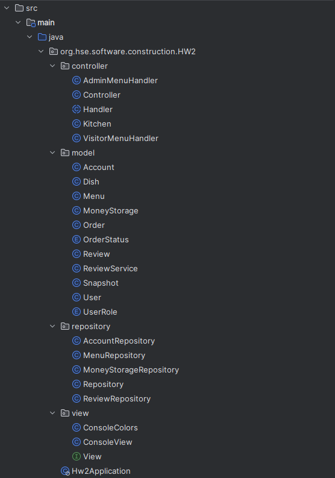
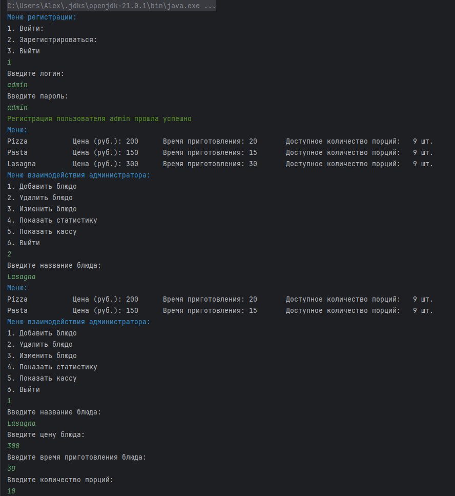
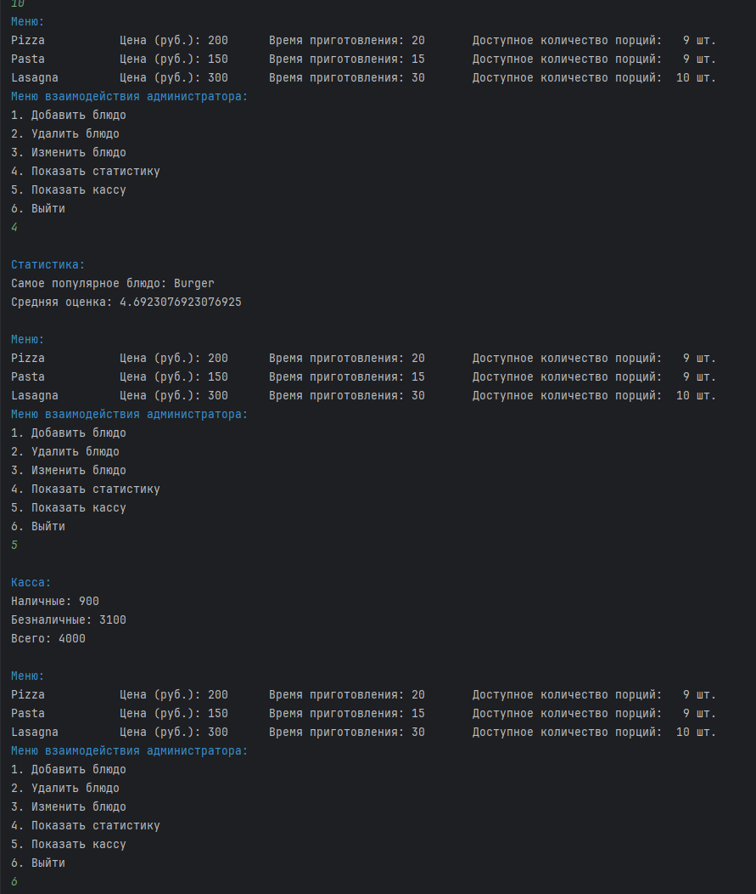
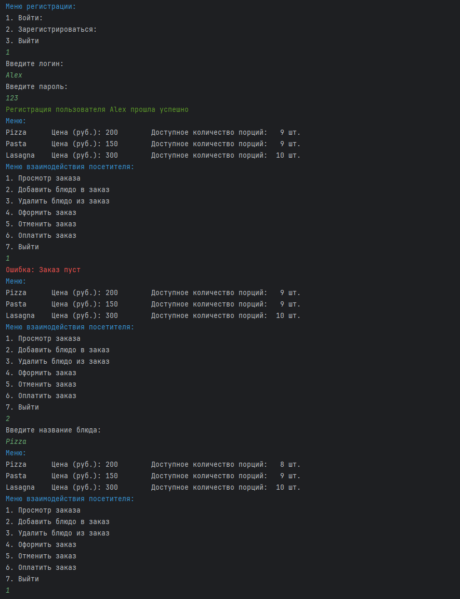
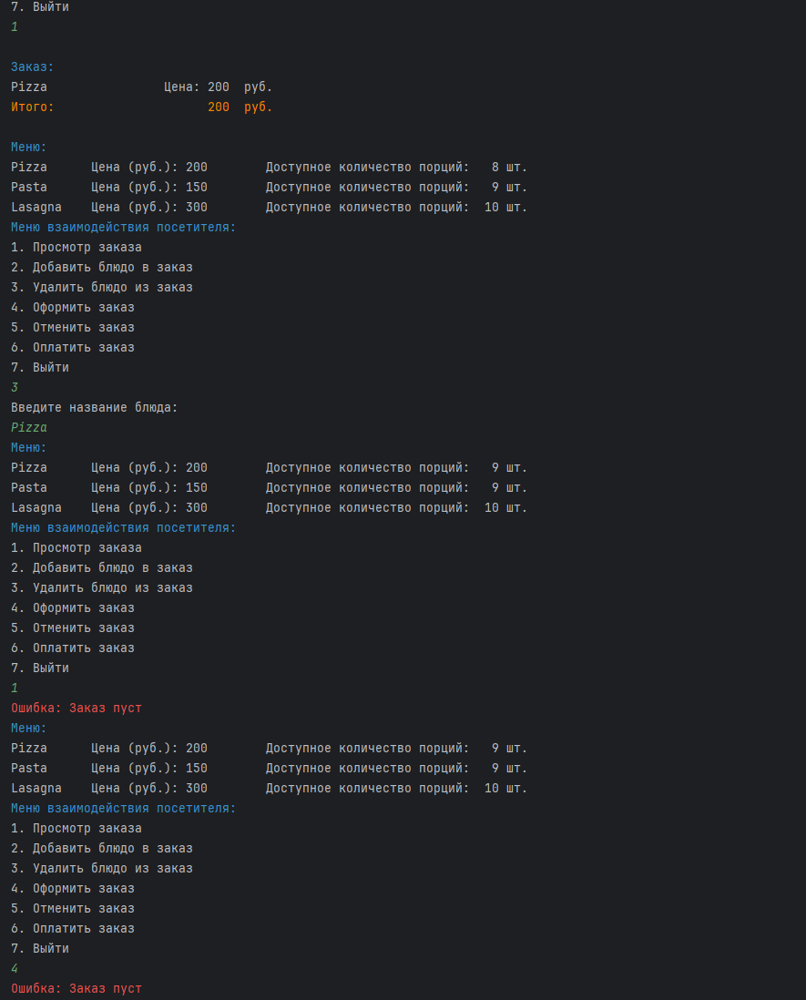
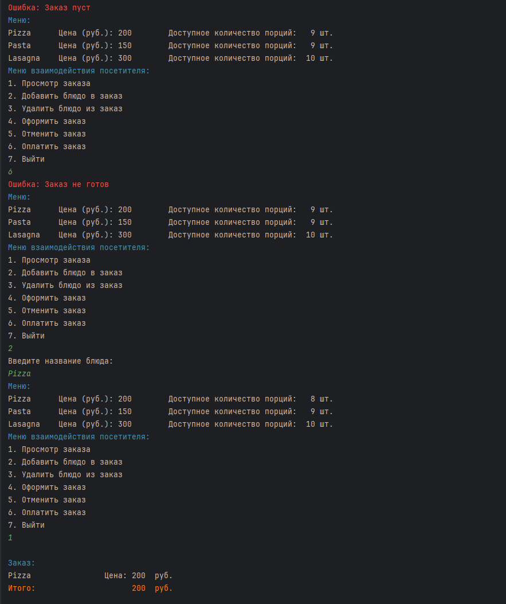
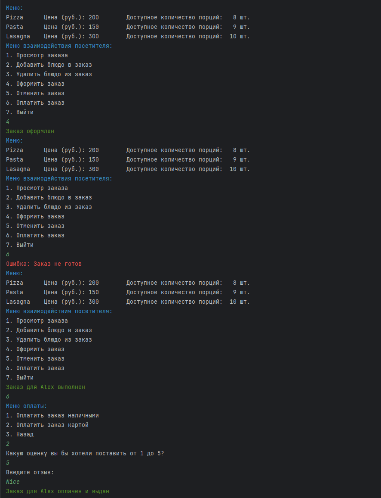
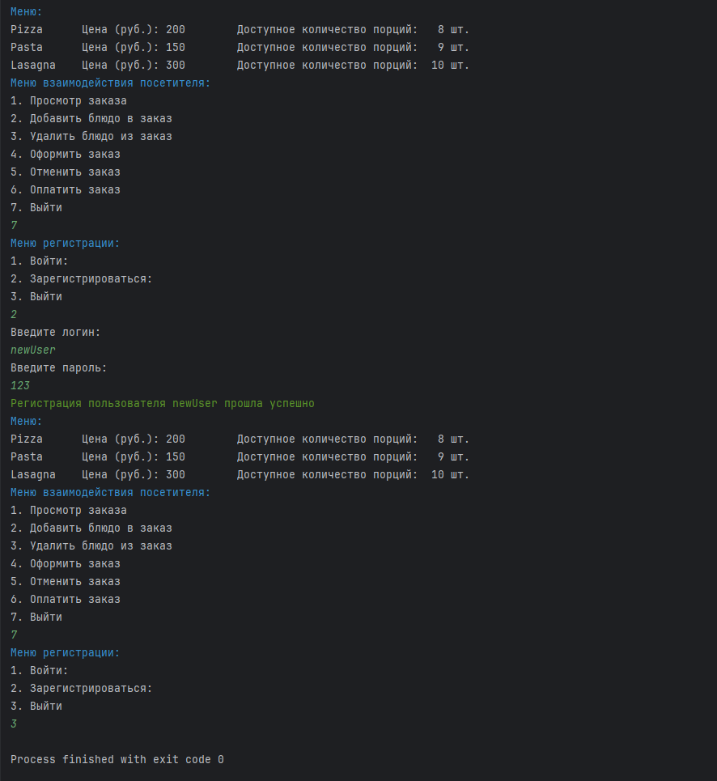

# Домашнее задание №2
## Евсюков Александр   Группа БПИ224

### Набор требований к проекту:
* `Java` версии 21
* `Gradle` версии 8.2
* `Spring Boot` версии 3.2.2

### Инструкция по запуску:
1. Склонируйте репозиторий с помощью команды `git clone
2. Откройте проект в `IntelliJ IDEA`
3. Запустите проект с помощью комбинации клавиш `Ctrl + F10` или нажав на кнопку `Run` в правом верхнем углу
   (пытался запустить через терминал, но там что-то непонятное происходит)

### Структура проекта:

Проект построен согласно архитектурному паттерну MVC:
- Файл `HW2Application` - точка входа в приложение
- В пакете `model` находятся модели данных 
    * `Account` - модель хранящая информацию о пользователях с методами для регистрации и авторизации
    * `Dish` - модель реализующая блюда
    * `Menu` - класс, который хранит список блюд и заказы, а также методы для работы с ними
    * `MoneyStorage` - модель хранящая информацию о кассе 
    * `Order` - модель реализующая заказы 
    * `OrderStatus` - перечисление, которое хранит статусы заказов
    * `Review` - модель реализующая отзывы
    * `ReviewService` - класс, который хранит список отзывов и методы для работы с ними
    * `Snapshot` - модель реализующая снимки состояния
    * `User` - модель реализующая пользователей
    * `UserRole` - перечисление, которое хранит роли пользователей
- В пакете `views` находятся представления
    * `ConsoleColoes` - класс, который хранит цвета для консоли
    * `ConsoleView` - класс, который выводит информацию в консоль
    * `View` - интерфейс, который реализуют классы, которые выводят информацию в консоль (создан для удобства восприятия кода)
- В пакете `controllers` находится контроллер
    * `Controller` - основной класс, который загружает состояние приложения и вызывает Цепочку обязанностей для обработки запросов
    * `Handler` - интерфейс, который реализуют классы, которые обрабатывают запросы
    * `AdminMenuHandler` - класс, который обрабатывает запросы администратора, позволяет взаимодействовать с меню и статистикой
    * `VisitorMenuHandler` - класс, который обрабатывает запросы посетителя, позволяет взаимодействовать с меню и заказами, 
  а также оплатой и отзывами
    * `Kitchen` - класс, который создает 3 потока реализующих поваров и обрабатывает заказы
- В пакете `Repository` находится репозиторий
    * `Repository` - класс, который управляет сохранением и извлечением данных из файлов
    * `AccountRepository` - класс, который cохраняет и извлекает данные о пользователях
    * `MenuRepository` - класс, который cохраняет и извлекает данные о меню
    * `ReviewRepository` - класс, который cохраняет и извлекает данные об отзывах
    * `MoneyStorageRepository` - класс, который cохраняет и извлекает данные о кассе

### Используемые паттерны:
- `Chain of Responsibility` - для обработки запросов от пользователя и администратора. Данный паттерн был использован для 
упрощения добавления новых обработчиков (к примеру Официанта, Бармена и т.д.)
- `Observer` - который почти аналогичен архитектурному паттерну MVC, который используется в данном проекте и упрощает 
понимание кода и его поддержку
- `Memento` - для сохранения состояния приложения, однако в данном проекте он не используется в полной мере, а скорее 
является основной идеи для реализации собственного принципа сохранения состояния

### Многопоточная обработка заказов:
Для обработки заказов был использован класс `Kitchen`, который создает 3 потока реализующих поваров и обрабатывает заказы. 
Повара создаются с некоторой задержкой, чтобы избежать ситуации, когда все повара одновременно начинают готовить заказы, 
хотя каждый повар при взятии заказа устанавливает ему соответсвующий статус. Работа поваров происходит в бесконечном цикле,
повар просматривает все заказы и если находит заказ со статусом `ACCEPTED`, то он начинает готовить его. Готовка заказа
происходит по прицепу `Thread.sleep()`, чтобы имитировать процесс готовки. Время ожидания зависит от общего времени готовки 
заказа (1000*TotalCookingTime). Такой период задержки выбран для того, чтобы можно было зайти в систему под другим
пользователем и проверить работу других потоков. После готовки заказа повар устанавливает ему статус `DONE` и начинает 
поиск нового заказа. После завершения основного потока приложения все потоки завершают свою работу. 

Одним из критериев оценки является реализовать очередь выполнения заказов и я ее реализовал. На первый взгляд кажется, что
никакой очереди нет, но Виктор Петрович Баринов однажды сказал `Я всем подаю по очереди. Этот человек раньше заказал свой суп, он
его раньше получит`. Поэтому заказы обрабатываются в порядке их поступления без особых привилегий.

### Скриншоты работы программы:
Данные скриншоты можно воспринимать как пример использования программы

и т.д.
